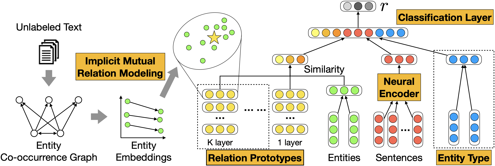
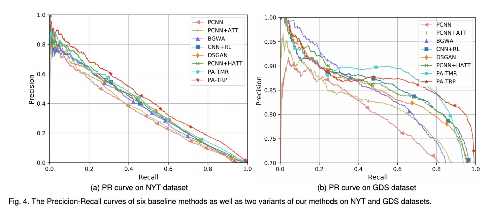

# Learning Relation Prototype from Unlabeled Texts for Long-tail Relation Extraction




This repository provides the code for our TKDE paper: *Learning Relation Prototype from Unlabeled Texts for Long-tail Relation Extraction*.

## Dependencies

```
tqdm==4.46.0
numpy==1.18.5
tensorflow_gpu==1.15.0
matplotlib==3.3.3
scikit_learn==0.24.2
```


## Quick Start

You can run the experiments in just two steps:

### Download dataset

We use  [Riedel NYT](http://iesl.cs.umass.edu/riedel/ecml/) and [Google Distant Supervision (GDS)](https://arxiv.org/pdf/1804.06987.pdf) dataset for evaluation. We have uploaded the preprocessed dataset and the pretrained files on [Google Driver](https://drive.google.com/file/d/1b6a7Rzf0GGfvwyhlv-OTyd4lqfKkdvAD/view?usp=sharing). Download the [data.zip](https://drive.google.com/file/d/1b6a7Rzf0GGfvwyhlv-OTyd4lqfKkdvAD/view?usp=sharing) and uncompress it to `algorithm/`

### Run experiments

For training the relation extraction model, run the following command:

```shell
python3 train.py {DATASET_NAME} {ENCODER} {SELECTOR} {EXP}
```

Where the `DATASET_NAME` can be `nyt` or `gids` , the  `ENCODER` can be `pcnn` ,`cnn`  or `rnn`, the  `SELECTOR` can be `ave(means average pooling)` or `att(means selective attention)`, and the `EXP` can be `trp/tmr/none`, which means using relation prototype,  implicit mutual relation or nothing, more details please refer to out paper. As illustrated in our paper, the model achived best performance is PA-TRP, which can be trained by the following command:

```shell
python3 train.py nyt pcnn att trp
```

For testing, run:

```
python3 test.py {DATASET_NAME} {MODEL_NAME}
```


## Result



## Citation
Please cite the following papers if you use this code in your work.
```
@ARTICLE{9483677,
  author={Cao, Yixin and Kuang, Jun and Gao, Ming and Zhou, Aoying and Wen, Yonggang and Chua, Tat-Seng},
  journal={IEEE Transactions on Knowledge and Data Engineering}, 
  title={Learning Relation Prototype from Unlabeled Texts for Long-tail Relation Extraction}, 
  year={2021},
  volume={},
  number={},
  pages={1-1},
  doi={10.1109/TKDE.2021.3096200}}
```
```
@inproceedings{DBLP:conf/icde/Kuang0Z00Z20,
  author       = {Jun Kuang and
                  Yixin Cao and
                  Jianbing Zheng and
                  Xiangnan He and
                  Ming Gao and
                  Aoying Zhou},
  title        = {Improving Neural Relation Extraction with Implicit Mutual Relations},
  booktitle    = {36th {IEEE} International Conference on Data Engineering, {ICDE} 2020,
                  Dallas, TX, USA, April 20-24, 2020},
  pages        = {1021--1032},
  publisher    = {{IEEE}},
  year         = {2020},
  url          = {https://doi.org/10.1109/ICDE48307.2020.00093},
  doi          = {10.1109/ICDE48307.2020.00093},
  timestamp    = {Tue, 01 Mar 2022 17:47:39 +0100},
  biburl       = {https://dblp.org/rec/conf/icde/Kuang0Z00Z20.bib},
  bibsource    = {dblp computer science bibliography, https://dblp.org}
}
```


## Reference

* [OpenNRE](https://github.com/thunlp/OpenNRE/tree/tensorflow)
